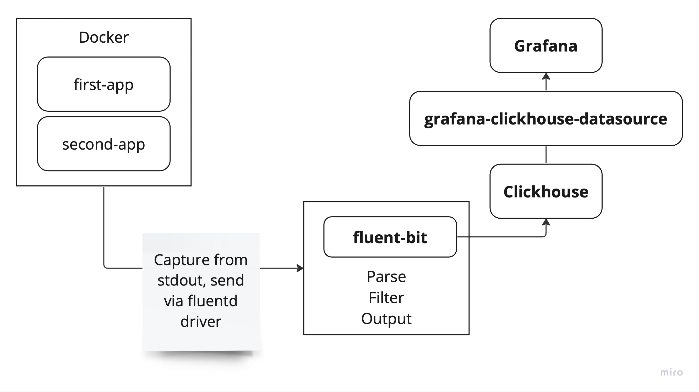

# Пример настройки логирования с использованием Clickhouse и Fluentbit

В `docker-compose.yml` определены два приложения: `first-app`, `second-app`. 
В репозитории показаны настройки fluent-bit, сервисов docker compose, clickhouse для
настройки пайплайна логов.

Изначально docker забирает логи из stdout контейнера, затем направляет 
их в fluent-bit с помощью драйвера fluentd. fluent-bit парсит и фильтрует логи,
а после отправляет их в clickhouse пачкой.

{width=600px}

## 1. Подготавливаем Clickhouse

Для запуска демонстрации надо подготовить Clickhouse.

Сначала запустим контейнер:

```shell
docker compose up -d ch
```

В контейнере зайдем в clickhouse-client

```shell
$ docker compose exec -it ch
$ clickhouse-client
```

Теперь клиент подключен к БД `default`

**Создание таблицы логов**. Чтобы создать таблицу логов выполните SQL запрос
предоставленный в [create-table-test_2.sql](./clickhouse-setup/create-table-test_2.sql).

**Сменить пользователю default пароль**. По умолчанию пароль не задан. Чтобы задать пароль, нужно обновить файл
`/etc/clickhouse-server-users.xml`. В файле `fluent-bit.conf` явно задан пароль `qwerty`,
зададим его для пользователя `default`.

В секции `<users>` нужно добавить пароль в тег `<password>`:

```xml
<clickhouse>
    <users>
        <default>
            <password>qwerty</password>
        </default>
    </users>
</clickhouse>
```

## 2. Запускаем fluent-bit

До запуска пушки должен уже быть запущен fluent-bit

```sh
docker compose up -d fluent-bit
```

## 3. Запускаем пушку логов

В качестве пушки логов используется два nodejs приложения, которые нужно предварительно сбилдить.

```sh
docker compose build first-app
```

```sh
docker compose build second-app
```

Теперь запускаем пушку. Каждое приложение отправляет в stdout 5 логов в секунду.

```sh
docker compose up -d first-app second-app
```

## 4. Подключаемся к Grafana

Чтобы подключиться к Clickhouse из Grafana воспользуйтесь документацией: 
[Connecting Grafana to Clickhouse](https://clickhouse.com/docs/en/integrations/grafana#4-build-a-dashboard).
