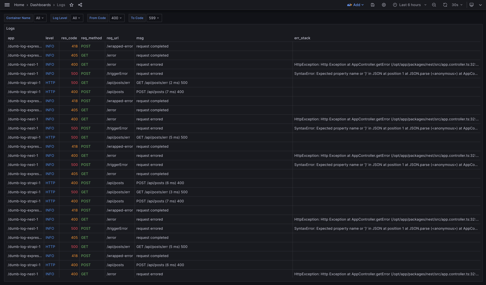

# Логирование Node.js приложений с использованием ClickHouse, Fluentbit, Grafana

В репозитории на примере нескольких Node.js приложений показана настройка
логеров Pino, Winston. Приложения пишут логи в stdout. Драйвером выступает
fluentd; fluent-bit парсит логи и передает в ClickHouse. Визуализация
осуществляется в Grafana.



**Приложения**

- [Express (Pino)](./packages/express)
- [Nest (Pino)](./packages/nest)
- [Strapi (Winston)](./packages/strapi)

В пакете [packages/gun](./packages/gun) имплементирована пушка запросов,
написана на Node.js. Она отправляет запросы в указанные выше приложения.

Все приложения и пушка поднимаются в Docker.

## Демонстрационный запуск

### 1. Подготавливаем Clickhouse

Для запуска демонстрации надо подготовить Clickhouse.

Сначала запустим контейнер:

```shell
docker compose up -d clickhouse
```

- Автоматически будет создана таблица `logs` в БД `default`. Таблица определена
  в [этом
  файле](./clickhouse/config/docker-entrypoint-initdb.d/create-logs-table.sql).
- Автоматически будет создан пользователь `default` с паролем `qwerty`.

### 2. Запускаем fluent-bit

До запуска пушки должен уже быть запущен fluent-bit

```sh
docker compose up -d fluent-bit
```

## 4. Подключаем Grafana к ClickHouse

Чтобы подключиться к Clickhouse из Grafana воспользуйтесь документацией:
[Connecting Grafana to
Clickhouse](https://clickhouse.com/docs/en/integrations/grafana#4-build-a-dashboard).

В файле [.grafana/logs.json](./.grafana/logs.json) можно найти конфигурацию
дашборда. Там уже определены SQL запросы, переменные и подсветка, достаточно
импортировать дашборд себе.

### 4. Запускаем приложения и пушку

В каждом из приложений есть env переменные определяющие характер логирования.
Достаточно скопировать в каждом из пакетов `example.env` в `docker.env`.

```sh
cp example.env docker.env
```

**Собираем образы**

```sh
docker compose build express gun nest strapi
```

**Запускаем приложения и пушку**

```sh
docker compose up -d express gun nest strapi
```
