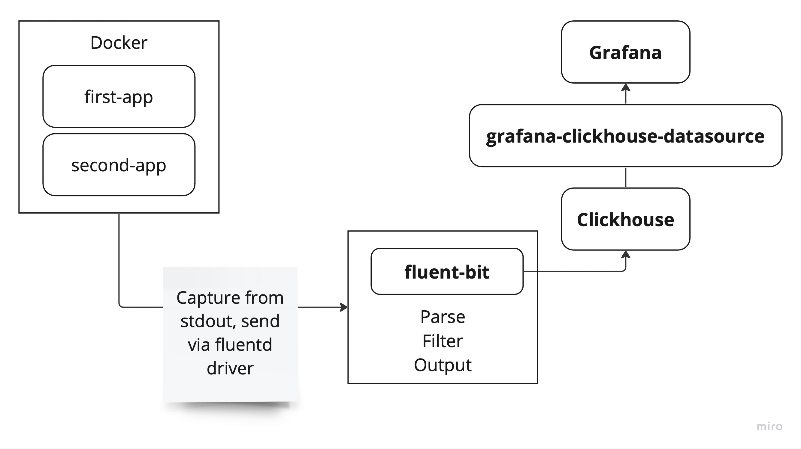

# Пример настройки логирования с использованием Clickhouse и Fluentbit

В `docker-compose.yml` определены два приложения: `first-app`, `second-app`. В
репозитории показаны настройки fluent-bit, сервисов docker compose, clickhouse
для настройки пайплайна логов.

Изначально docker забирает логи из stdout контейнера, затем направляет их в
fluent-bit с помощью драйвера fluentd. fluent-bit парсит и фильтрует логи, а
после отправляет их в clickhouse пачкой.

{width=600px}

## 1. Подготавливаем Clickhouse

Для запуска демонстрации надо подготовить Clickhouse.

Сначала запустим контейнер:

```shell
docker compose up -d ch
```

В контейнере зайдем в clickhouse-client

```shell
$ docker compose exec -it ch
$ clickhouse-client
```

Теперь клиент подключен к БД `default` и можно перейти к созданию таблицы для логов.

**Создание таблицы логов**. Чтобы создать таблицу логов выполните SQL запрос
предоставленный в [create-logs-table.sql](./clickhouse/config/docker-entrypoint-initdb.d/create-logs-table.sql).

## 2. Запускаем fluent-bit

До запуска пушки должен уже быть запущен fluent-bit

```sh
docker compose up -d fluent-bit
```

## 3. Запускаем пушку логов

В качестве пушки логов используется два Node.js приложения, которые нужно
предварительно сбилдить.

```sh
docker compose build first-app
```

```sh
docker compose build second-app
```

Теперь запускаем пушку. Каждое приложение отправляет в stdout 5 логов в секунду.

```sh
docker compose up -d first-app second-app
```

## 4. Подключаемся к Grafana

Чтобы подключиться к Clickhouse из Grafana воспользуйтесь документацией:
[Connecting Grafana to
Clickhouse](https://clickhouse.com/docs/en/integrations/grafana#4-build-a-dashboard).
